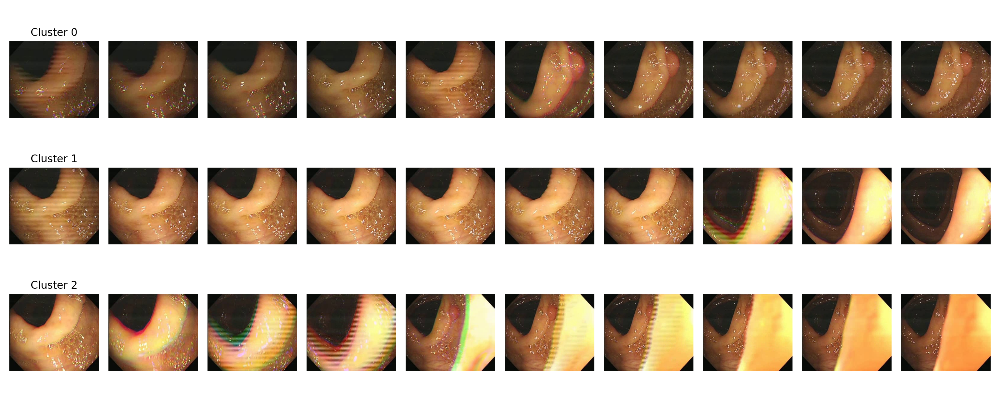

# Hyper-Parameter Fine-Tuning and Representation Analysis for M2CRL

This repository presents a **research-oriented reproduction and analysis project** built on top of an M2CRL-style self-supervised learning pipeline.  
The focus is not only on training or fine-tuning a model, but on **understanding, validating, and visualizing the learned representations** through systematic experimentation.

The project demonstrates how **hyper-parameter choices and fine-tuning strategies** affect representation quality, and how those representations can be analyzed using **feature extraction and clustering** on real medical video data.

---

## Motivation

In many research and industrial settings, models are trained and reported solely based on final performance metrics.  
However, **representation learning** requires deeper inspection:

- Does the model converge stably during fine-tuning?
- Do learned embeddings meaningfully separate visual patterns?
- Can we qualitatively validate representation structure beyond accuracy numbers?

This repository addresses these questions by combining:
- fine-tuning experiments,
- loss monitoring,
- and **embedding-level clustering analysis**.

---

## What This Repository Contains

### 1. Fine-Tuning Experimentation
A Vision Transformer–based backbone is fine-tuned using a downstream task configuration inspired by M2CRL-style training.  
Training dynamics are logged and preserved to ensure **reproducibility and transparency**.

### 2. Loss Curve Analysis
The training loss is logged per epoch and visualized to verify:
- optimization stability,
- absence of divergence or collapse,
- and effective adaptation during fine-tuning.

**Training Loss Curve:**


This curve shows:
- a sharp initial drop (expected during early adaptation),
- followed by smooth convergence,
- indicating a stable fine-tuning process rather than overfitting or instability.

---

### 3. Representation Extraction
After fine-tuning, the model is used as a **feature extractor** on video data:
- frames are extracted from a medical video,
- embeddings are computed using the fine-tuned backbone,
- no labels are used at this stage.

This ensures the analysis focuses on **intrinsic representation quality**, not classifier behavior.

---

### 4. Clustering-Based Representation Analysis
Extracted embeddings are clustered using an unsupervised algorithm (K-Means).  
To make the results interpretable, representative frames from each cluster are visualized.

**Embedding Clustering Result (Single Video):**



This visualization provides qualitative insight into:
- how the model groups visually similar frames,
- whether temporal or semantic structure emerges naturally,
- and how well the learned embedding space separates patterns.


## Repository Structure

```text
.
├── assets/
│   ├── loss_curve.png          # Training loss visualization
│   └── cluster.png             # Embedding clustering visualization
├── results/                    # Generated outputs (gitignored)
│   ├── single_video_features.npy
│   └── cluster_labels.npy
├── scripts/
│   ├── run_single_video_cluster_polypdiag.py
│   └── plot_loss_from_csv.py
├── models/                     # Model definitions
├── utils/                      # Helper utilities
├── dataset.py
├── extract_features.py
├── cluster_and_plot.py
├── requirements.txt
├── README.md
└── LICENSE

